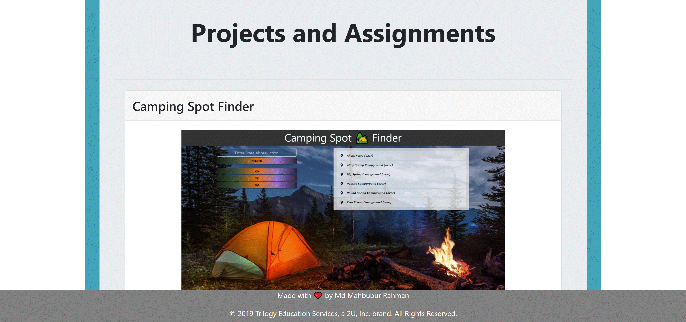
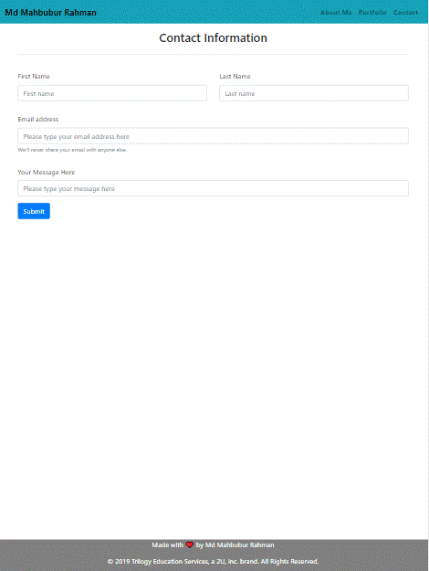

# 08_Updated_Portfolio_Page_MR

## Link to deployed application

https://mahbub798.github.io/08_Updated_Portfolio_Page_MR/

## Description 

I used the Bootstrap CSS Framework to create a mobile responsive portfolio. I followed some guidelines:

* Created the following files files: `index.html`, `portfolio.html` and `contact.html`.

* Used Bootstrap and developed portfolio site with the following items:

   * A navbar

   * A responsive layout

   * Responsive images

* The Bootstrap portfolio minimize the use of media queries.git

* Used Bootstrap's grid system (containers, rows, and columns).

* On an `xs` screen, content take up the entire screen. On `sm` and larger screens, I have some margins on the left and right sides of the screen. Checked out various sites on my mobile device vs. my computer to see examples of these differences.

* Used an HTML validation service to ensure that each page has valid HTML.

## Mock-Up

The following image shows the web application's appearance and functionality:

